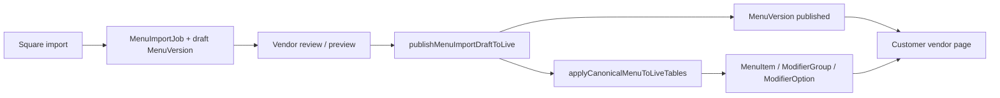

# Square Menu Draft Preview & Publish

**Date:** 2026-07-08

## Summary

Square catalog import already wrote draft `MenuVersion` canonical snapshots and `ProviderEntityMapping` records, but vendors only saw a flat import report. The missing piece was **menu source matching** (Square snapshots were treated as Deliverect) and **vendor UX** to preview/publish the existing draft lifecycle.

This sprint wires Square imports into the same draft → review → publish path Deliverect uses, fixes public menu loading for Square-imported menus, and surfaces grouped preview + publish on Menu Imports.

## Part 1 — Existing menu publish path (audit)

### Canonical path to public menu



| Layer | Storage |
|-------|---------|
| Draft | `MenuVersion` (`state=draft`) + `MenuImportJob` (`awaiting_review`) |
| Published snapshot | `MenuVersion` (`state=published`) with `canonicalSnapshot` JSON |
| Live runtime | `MenuItem`, `ModifierGroup`, `ModifierOption`, `MenuItemModifierGroup` |
| Provider linkage | `ProviderEntityMapping` (Square external ids) |

**Publish service:** `publishMenuImportDraftToLive` in `src/services/menu-publish-from-canonical.service.ts`  
**Vendor API:** `POST /api/vendor/{vendorId}/menu-imports/{jobId}/publish`  
**Review page:** `/vendor/{vendorId}/menu-imports/{jobId}` (already had `MenuImportMenuPreview` + `MenuImportPublishPanel`)

Open Order Menu Builder uses a separate draft workspace (`VendorMenuCategory` + `oo:prod:*` rows) but the same `applyCanonicalMenuToLiveTables` on publish.

## Part 2 — Where Square import writes draft data

**No rebuild of the import pipeline.** Square import already:

- Normalizes catalog → `OpenOrderCanonicalMenu` (`square_catalog_v1`)
- Creates `MenuImportJob` (`SQUARE_CATALOG_PULL`)
- Creates draft `MenuVersion` with canonical snapshot
- Upserts `ProviderEntityMapping` via stable `sq:*` internal ids

Draft data lives in **`MenuVersion.canonicalSnapshot`** (same as Deliverect), not in live `MenuItem` rows until publish. This is the smallest safe draft layer — live tables are only updated on intentional publish.

## Part 3 — Root bug fix: menu source matching

Square vendors use `menuSource=open_order`, but Square snapshots were classified as Deliverect:

| Before | After |
|--------|-------|
| `square_catalog_v1` → `deliverect` menu source | `square_catalog_v1` → `open_order` menu source |
| `sq:prod:*` ids excluded from customer menu | `sq:prod:*` ids included for `open_order` menu source |

**Files:** `src/lib/vendor-menu-source.ts`, `src/lib/integrations/square/square-menu-ids.ts`

Without this fix, published Square menus would not appear on the public vendor page.

## Part 4 — Preview route / component

| Surface | Behavior |
|---------|----------|
| `/vendor/{vendorId}/menu/imports` (Square panel) | Inline **Draft menu preview** via `MenuImportMenuPreview` (categories, items, modifiers, prices) |
| `/vendor/{vendorId}/menu-imports/{jobId}` | Full review: diff, issues, grouped preview, publish/discard |
| Post-import CTA | **Preview and publish menu** → job review page |

Preview shows the canonical draft that will be published — not the flat import stats report.

## Part 5 — Publish action

| Feature | Implementation |
|---------|----------------|
| Button | **Publish imported menu** (Square panel + job review page) |
| Confirmation | “Publishing will replace this vendor's currently published menu with the imported Square menu. Open Order checkout and payouts are unchanged.” |
| Permission | Existing vendor dashboard auth on publish API |
| Square health | `assertSquareMenuPublishAllowed` blocks publish if Square connection unhealthy |
| Min items | ≥1 product and ≥1 **available** product required |
| Auto-publish | None (unchanged) |

**Files:** `MenuImportPublishPanel.tsx`, publish API route, `square-menu-publish-guard.server.ts`, publish eligibility updates

## Part 6 — Menu source clarity (vendor UI)

Square Menu Imports panel shows:

- Published menu source (e.g. “Square import”)
- Last imported from Square (relative time)
- Last published (relative time)
- Order routing label + “order injection not live yet”

Publishing a Square menu does **not** enable Square order injection.

## Part 7 — Re-import behavior (unchanged semantics)

| Behavior | Status |
|----------|--------|
| Re-import creates new draft job/version | Unchanged |
| Published menu stays live until new publish | Unchanged |
| `ProviderEntityMapping` upserted idempotently | Unchanged |
| Removed Square objects deactivated in mappings | Unchanged (`deactivateProviderMappingsNotSeen`) |
| Stale live rows soft-disabled on publish | Unchanged (`applyCanonicalMenuToLiveTables`) |

## Part 8 — ProviderEntityMapping after publish

Publish does not delete or recreate mappings. Mappings remain linked to `sq:*` internal entity ids through publish and customer menu load.

## Part 9 — Public menu verification

After publish + menu source fix:

1. `MenuVersion` → `published` with `square_catalog_v1` snapshot
2. `applyCanonicalMenuToLiveTables` writes `MenuItem` rows with `deliverectProductId=sq:prod:*`
3. `loadActiveMenuVersionForVendor` matches snapshot to `menuSource=open_order`
4. `menuItemDeliverectIdMatchesMenuSource` includes `sq:prod:*` ids
5. Customer page loads grouped menu via `loadCustomerVendorMenuSections`

Cart/add flow uses existing OO menu structures; no checkout changes.

## Files changed

| File | Change |
|------|--------|
| `src/lib/vendor-menu-source.ts` | Square canonical + product id matching |
| `src/lib/integrations/square/square-menu-ids.ts` | `isSquare*DeliverectId` helpers |
| `src/lib/integrations/square/square-menu-publish-guard.server.ts` | Publish-time Square health check |
| `src/lib/vendor-square-menu-imports-panel-data.server.ts` | Panel data loader |
| `src/components/vendor/menu-imports/VendorSquareMenuImportsPanel.tsx` | Draft preview, publish, job table, status |
| `src/components/vendor/VendorSquareCatalogCard.tsx` | Post-import CTA copy |
| `src/components/menu-import/MenuImportPublishPanel.tsx` | Square publish labels + confirmation |
| `src/app/vendor/[vendorId]/menu-imports/[jobId]/page.tsx` | Square-specific publish copy |
| `src/app/api/vendor/.../publish/route.ts` | Square guard + revalidation |
| `src/lib/menu-import-publish-eligibility.ts` | Require ≥1 available product |
| `src/services/menu-publish-from-canonical.service.ts` | `NO_AVAILABLE_PRODUCTS` validation |
| `src/lib/menu-import-ui-labels.ts` | “Square catalog” source label |
| Tests | menu source, eligibility, publish guard, panel structure |

## Tests / QA

| # | Test | Result |
|---|------|--------|
| 1 | Import writes draft MenuVersion (not report-only) | Pass (`square-menu-import.service.test.ts`) |
| 2 | Preview renders categories/items/modifiers | Pass (panel + `MenuImportMenuPreview`) |
| 3 | Not public before publish | Pass (draft `MenuVersion.state=draft`) |
| 4 | Publish requires vendor auth | Pass (existing API) |
| 5 | Publish requires available product | Pass (`menu-import-publish-eligibility.test.ts`) |
| 6 | Publish only after confirmation | Pass (`MenuImportPublishPanel`) |
| 7 | Public menu loads Square ids after publish | Pass (menu source fix) |
| 8 | Re-import idempotent mappings | Pass (existing import service tests) |
| 9 | Removed objects deactivated | Pass (existing `deactivateProviderMappingsNotSeen`) |
| 10 | Mappings preserved on publish | Pass (publish does not touch mappings) |
| 11 | Deliverect/manual unchanged | Pass (no changes to those paths) |
| 12 | Build | Pass |

```bash
npm run test -- --run src/lib/vendor-menu-source.test.ts src/lib/menu-import-publish-eligibility.test.ts src/lib/integrations/square/square-menu-publish-guard.test.ts src/lib/integrations/square/square-menu-import.service.test.ts src/app/vendor/[vendorId]/vendor-menu-management.test.ts
npm run build
```

## Known limitations

- Draft preview reads canonical JSON, not live `MenuItem` rows (same as Deliverect review).
- Square order injection remains unimplemented; Square-routed vendors may still be non-orderable at checkout.
- Publish blocks if Square connection becomes unhealthy (by design).
- Modifier features unsupported by OO normalizer still surface as import warnings; blocking issues prevent publish.
- No separate `/integrations/square/import-preview` route — preview lives on Menu Imports + job review (preferred after UX retrofit).
